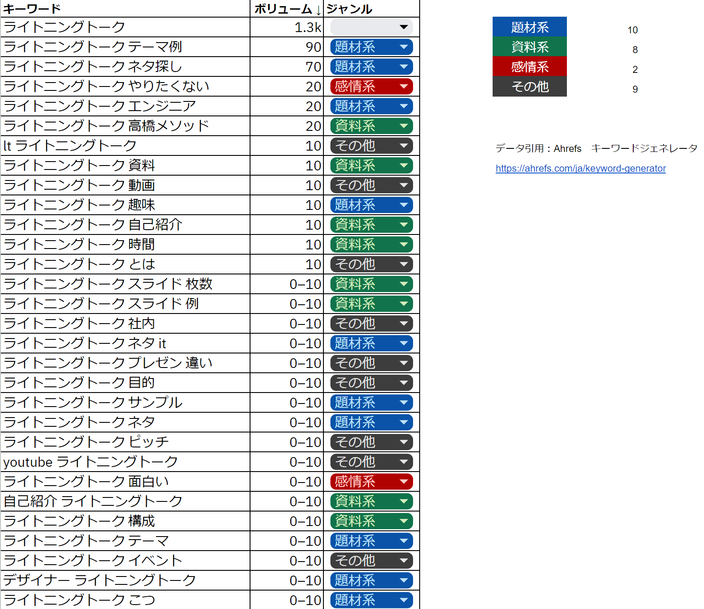
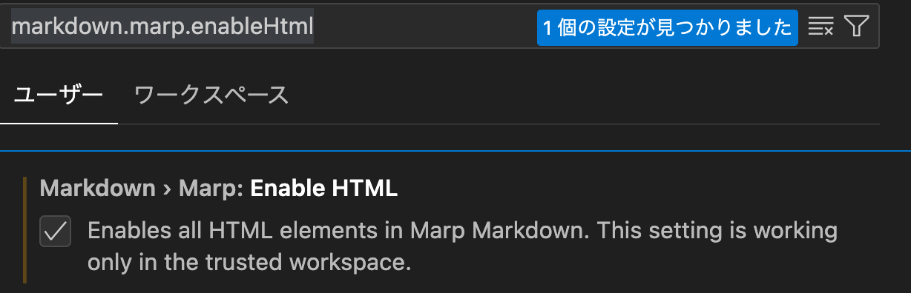
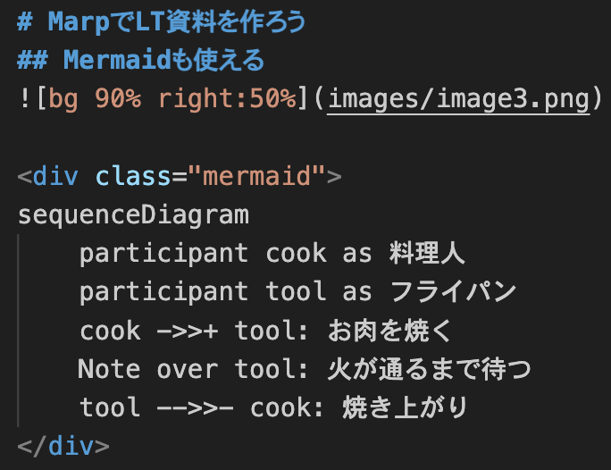
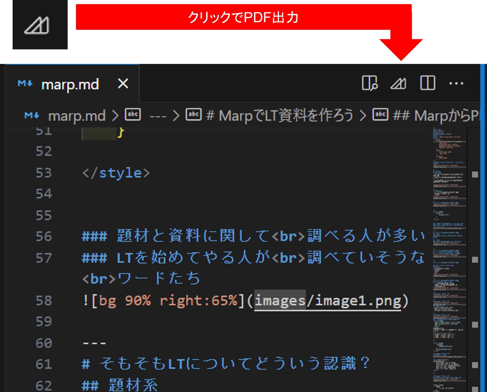

# Marpで資料を作ってLTへの参加ハードルを下げる


---
# 自己紹介
## 髙橋俊介
- 新卒で小売業界でSV(スーパーバイザー)として働く
- 2019年よりWebエンジニアとして働き始める
- 今年の2月から株式会社UtillでWebエンジニアとして働いている


---
# 本日のお題
- そもそもLTについてどういう認識？
- MarpでLT資料を作ろう
- まとめ


---
# そもそもLTについてどういう認識？


---
<style scoped>
    footer {
        display:none;
    }

</style>

# そもそもLTに<br>ついて<br>どういう認識？

- 題材と資料に関して<br>
- LTを始めてやる人が<br>気になりそうな点

などを調べる人が多い


---
# そもそもLTについてどういう認識？
## 大別すると以下の要素に集約される。
### 題材系
#### →人によるので一律に解決策が出しづらいこと。
<hr>

### 資料系
#### →ある程度、技術的に解決出来ること。


---
# そもそもLTについてどういう認識？
## 参加へのハードルを下げれそうな点
## →LT資料を作ることが楽になればいい


---
# そもそもLTについてどういう認識？

## 何を使ってLT資料を作る？
### ツール
- PPT、Google スライド
- Keynote
- Canva 
- etc...


---
# そもそもLTについてどういう認識？
## もっと楽に資料作りたい
- 資料作成に時間かけたくない
- 書き慣れてるMarkDownで書きたい
- 履歴管理したい


---
# MarpでLT資料を作ろう


---
# MarpでLT資料を作ろう

## Marpとは？
### Markdown Presentation Ecosystem
https://marp.app/
- Markdownでプレゼンテーション資料を簡単に作成できるツール。

- VScodeの拡張機能として「Marp for VS Code」があるため今回はこちらを使用。

---
# MarpでLT資料を作ろう

## 用意するもの
- Visual Studio Code (必須)
- Marp for VS Code (必須)
- Markdown Preview Mermaid（任意）
- GitHub アカウント（任意）
---

<style scoped>
    .mermaid{
        padding-left:2rem;
    }
    footer{display:none}
</style>

# MarpでLT資料を作ろう
## 効率的に使うための準備

VSCodeの設定で`markdown.marp.enableHtml`で検索して、checkを入れておくことでHTMLを認識できるようにしておく。

---

<style scoped>
    .mermaid{
        padding-left:2rem;
    }
    footer{display:none}
</style>

# MarpでLT資料を作ろう
## 今回触れること

- Marpで出来ることの概要
## 今回触れないこと
- MarkDownやMarp、Mermaidの記法について
- Marpのテーマファイル作成などの踏み込んだ部分

---
# MarpでLT資料を作ろう

## 基本的にMD記法なら何でも書ける
<style scoped>
  table { table-layout: fixed; width: 100%; display:table; font-size: 24px; }
</style>
【表サンプル】
| ID | name | created_at |
| --- | --- | --- |
| 1 | hogehoge | 2023-09-01 00:00:00 |
| 2  | fugafuga | 2023-09-01 19:00:00 |

---

<style scoped>
    .mermaid{
        padding-left:2rem;
    }
    footer{display:none}
</style>

# MarpでLT資料を作ろう
## Mermaidも使える


<div class="mermaid">
sequenceDiagram
    participant cook as 料理人
    participant tool as フライパン
    cook ->>+ tool: お肉を焼く
    Note over tool: 火が通るまで待つ
    tool -->>- cook: 焼き上がり
</div>

---

# MarpでLT資料を作ろう
## 特定のページだけスタイル変更したい


表示を変えたいページに
```
<style scoped>
    要素{
        セレクタ:プロパティ;
    }
</style>
```
を挿入することでscopedとしてCSSも割り当てられる。


---
<style scoped>
    footer{
        display:none
    }
</style>

# MarpでLT資料を作ろう
## Marpを出力
単純に出力するだけであればVSCode上で出力可能。


---
<style scoped>
    footer{
        display:none
    }
</style>

# MarpでLT資料を作ろう
## Marpを出力

VSCodeの設定で`markdown.marp.exportType`を開けば
- HTML/CSS
- PDF
- PowerPoint ドキュメント

と出力形式を選択することも可能。

---

# MarpでLT資料を作ろう
## 公開まで自動化したい


[@marp-team/marp-cli](https://github.com/marp-team/marp-cli)とGitHub Actionを使って、mainブランチにMergeすることで
スライドとして公開することも可能。

---

# まとめ
- LTはMarpを使って資料作成に時間を掛け過ぎない。
    - 使うことで1ページのボリュームを盛り過ぎずに済む。
- 社内でLT会をやる時などMarpで
    - GitHubなどで管理しておくと楽
    - テーマ用CSSを作って使いまわせるようにしておくことで更に効率化

---


<style scoped>
    h1{
        text-align:center
    }
</style>

# ご清聴ありがとうございました。
